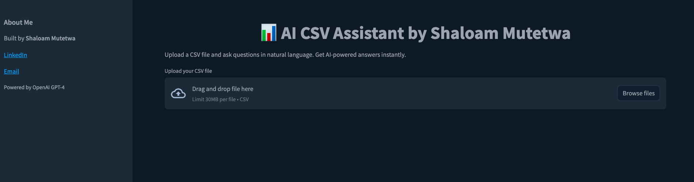

# Chat with Your CSV — by Shaloam Mutetwa

A lightweight Streamlit app that allows users to upload CSV files and interact with them using natural language, powered by OpenAI's GPT-4.

## Features
- Upload any CSV file
- Ask questions in plain English
- Get instant summaries and data insights
- No coding required

## Built With
- Python
- Streamlit
- OpenAI API (GPT-4)

##  Demo Use Cases
- AI-powered data summaries
- Data analysis of structured data
- Smart CSV analysis MVP

## How to Run

```bash
pip install -r requirements.txt
streamlit run app.py
 ```

## UI




